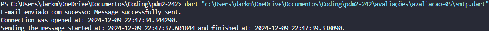
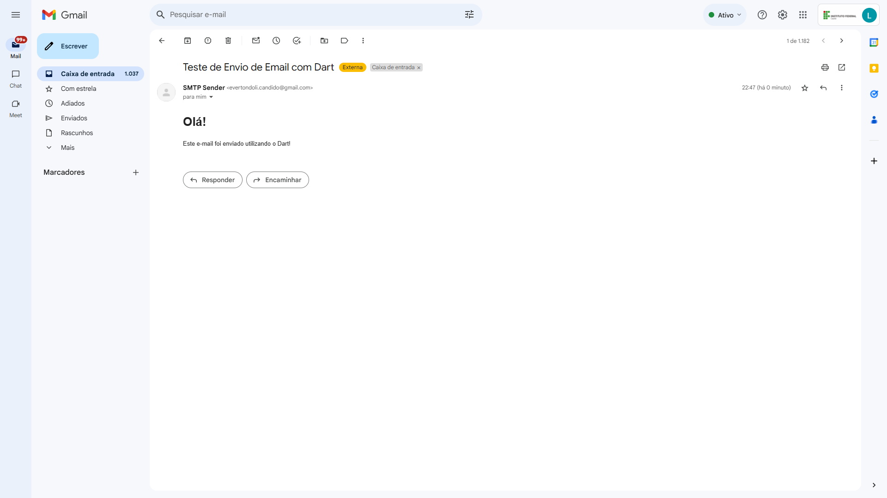

# Avaliação 5

Crie um programa cliente DART que usa a API do Gmail para enviar email para o GMAIL. Verificar o código exemplo em https://github.com/ricdtaveira/mobdev-parte-01/tree/master/17-acesso-rede no item SMTP. Evidencie o código e a execução do mesmo com prints que evidenciam a entrega do Email para uma determinada no Gmail (que pode ser a sua conta pessoal ou a conta DE EMAIL do IFCE).

Observação: Considere o exemplo do código do item 17.4 em https://github.com/ricdtaveira/mobdev-parte-01/blob/master/17-acesso-rede/README.md.

